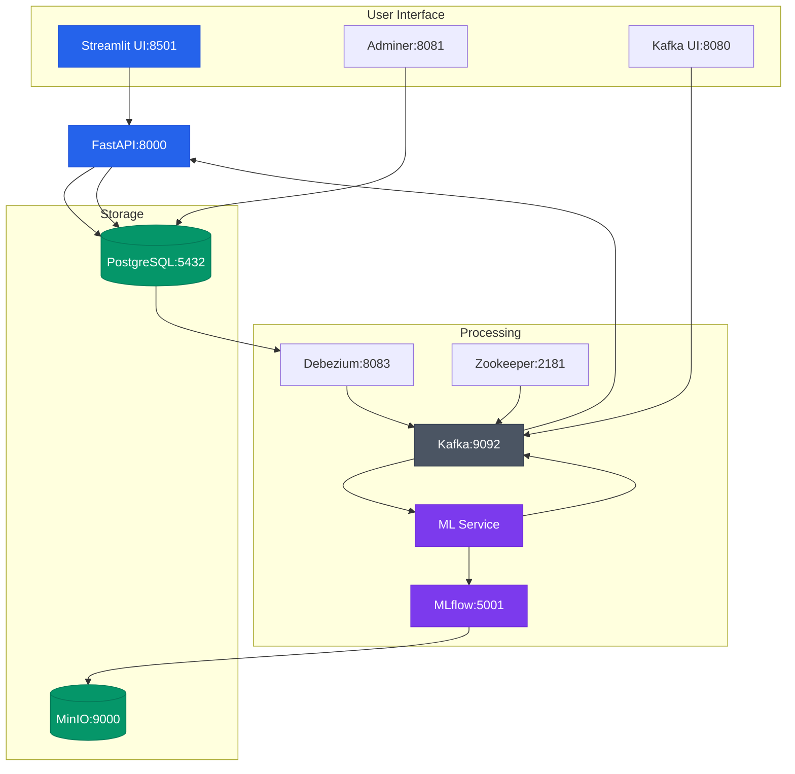

# Car Price Predictor

A machine learning system for predicting car prices using MLflow and Streamlit. This project implements a complete pipeline for predicting car prices with an interactive web interface and real-time visualization.

## Architecture

- **Frontend**: Streamlit application for data visualization and interaction
- **Backend**: FastAPI REST API for data management
- **ML Pipeline**: MLflow for model management and serving
- **Storage**: PostgreSQL for data storage, MinIO for model artifacts
  


## Prerequisites

- Docker and Docker Compose
- Python 3.9+ (for local development)

## Quick Start

1.Clone the repository:

```bash
git clone https://github.com/arkeodev/car-price-predictor
cd car-price-predictor
```

2.Start the services:

```bash
docker-compose up --build
```

3.Train the initial model:

```bash
cd ml_service
python train.py
```

4.Start the FastAPI backend:

```bash
cd backend
uvicorn main:app --reload
```

5.Start the Streamlit frontend:

```bash
cd web-ui
streamlit run app.py
```

6.Access the applications:

- Streamlit UI: <http://localhost:8501>
- FastAPI Docs: <http://localhost:8000/docs>
- MLflow UI: <http://localhost:5001>
- MinIO Console: <http://localhost:9001>
- Kafka UI: <http://localhost:8080>

## Project Structure

```ascii
.
├── backend/                # FastAPI backend service
│   ├── main.py            # Main API application
│   └── requirements.txt   # Python dependencies
├── data/                  # Training data
│   └── ford.csv          # Sample car data
├── ml_service/           # ML training and prediction service
│   ├── train.py         # Model training script
│   └── main.py          # Prediction service
├── mlflow/               # MLflow service configuration
├── postgres/            # PostgreSQL initialization scripts
├── web-ui/              # Streamlit frontend application
│   ├── app.py          # Main Streamlit application
│   └── requirements.txt # Python dependencies
├── docker-compose.yml   # Docker services configuration
└── README.md
```

## Features

- Real-time car price predictions
- Interactive data visualization with Streamlit
- RESTful API with FastAPI
- ML model versioning and tracking with MLflow
- Beautiful charts with Plotly
- Scalable architecture
- API documentation with Swagger UI

## Development

### Backend Development

```bash
cd backend
pip install -r requirements.txt
uvicorn main:app --reload --host 0.0.0.0 --port 8000
```

### Frontend Development

```bash
cd web-ui
pip install -r requirements.txt
streamlit run app.py
```

### ML Service Development

```bash
cd ml_service
pip install -r requirements.txt
python train.py
```

## API Documentation

The API documentation is available at `http://localhost:8000/docs` when the backend service is running. The following endpoints are available:

- `GET /cars`: List all cars
- `POST /cars`: Add a new car
- `GET /cars/{car_id}`: Get car details
- `GET /health`: Check service health

## Data Flow

1. User submits car data through Streamlit interface
2. Data is sent to FastAPI backend
3. ML service makes predictions using MLflow
4. Results are stored in PostgreSQL
5. Updated data is displayed in Streamlit UI

## Technologies Used

- **Backend**:
  - FastAPI for REST API
  - Pydantic for data validation
  - SQLAlchemy for database ORM

- **Frontend**:
  - Streamlit for UI
  - Plotly for data visualization
  - Pandas for data manipulation

- **ML Pipeline**:
  - MLflow for model management
  - scikit-learn for ML models
  - PostgreSQL for data storage
  - MinIO for artifact storage

## Contributing

1. Fork the repository
2. Create your feature branch (`git checkout -b feature/amazing-feature`)
3. Commit your changes (`git commit -m 'Add some amazing feature'`)
4. Push to the branch (`git push origin feature/amazing-feature`)
5. Open a Pull Request

## Acknowledgments

- Ford Used Car Dataset
- MLflow for ML model management
- FastAPI for the backend API
- Streamlit for the interactive UI
