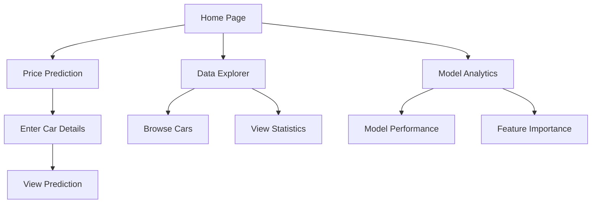
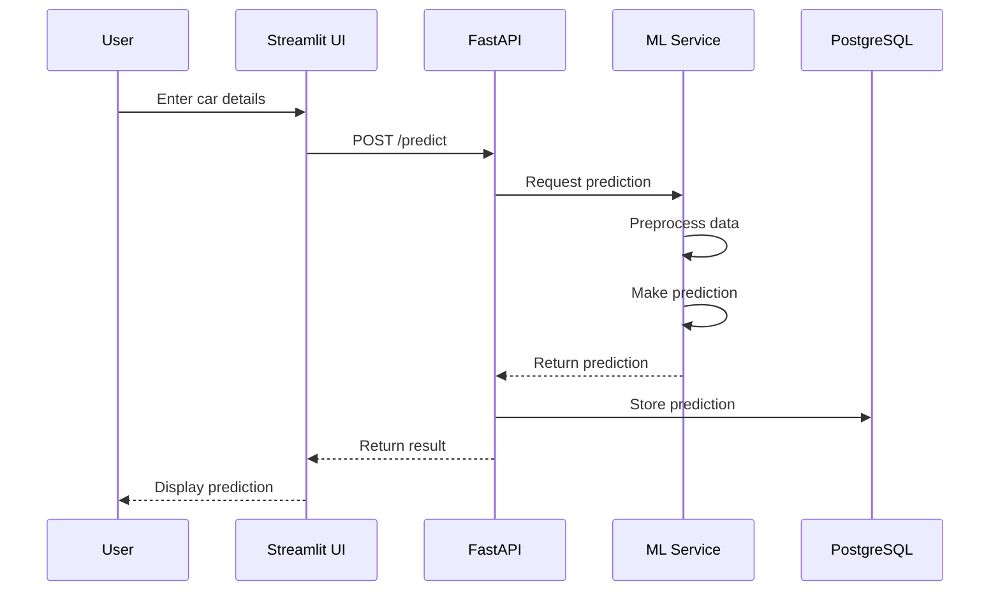
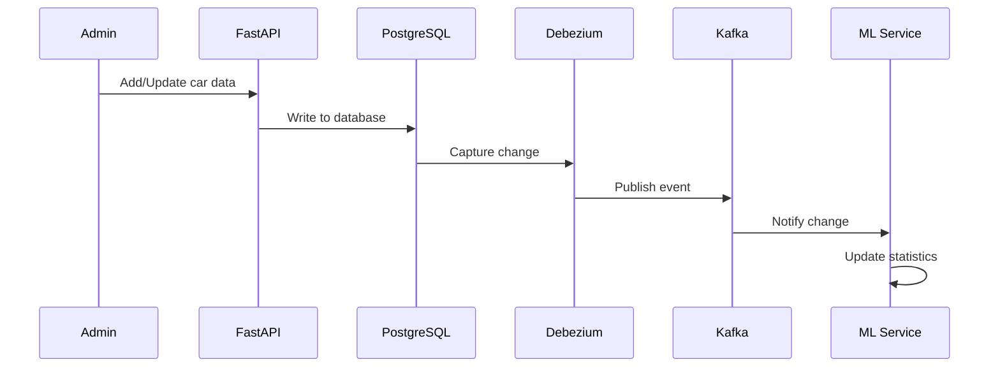

# Application Flow

## User Journey

### 1. Home Page

## Data Flow

### 1. Price Prediction Flow

### 2. Data Management Flow

## Component Interactions

### 1. Frontend (Streamlit)

- **User Interface Components**
  - Navigation menu
  - Input forms
  - Data visualizations
  - Results display

- **Data Flow**
  - API communication
  - State management
  - Real-time updates
  - Error handling

### 2. Backend (FastAPI)

- **Request Processing**
  - Input validation
  - Authentication
  - Route handling
  - Response formatting

- **Data Operations**
  - Database queries
  - Cache management
  - Event publishing
  - Error handling

### 3. ML Service

- **Prediction Pipeline**
  - Feature preprocessing
  - Model loading
  - Prediction generation
  - Confidence calculation

- **Model Management**
  - Version control
  - Performance monitoring
  - Retraining triggers
  - Error handling

## State Management

### 1. Session State

- User preferences
- Form data
- Temporary results
- Navigation history

### 2. Application State

- Model version
- Cache status
- System health
- Error states

### 3. Database State

- Car records
- Predictions
- Model metrics
- User data

## Error Handling

### 1. User Interface

- Input validation
- Error messages
- Retry mechanisms
- Fallback displays

### 2. API Layer

- Request validation
- Error responses
- Logging
- Recovery procedures

### 3. ML Service Errors

- Model errors
- Prediction failures
- Resource issues
- Monitoring alerts

## Performance Optimization

### 1. Caching Strategy

- API responses
- Prediction results
- Static assets
- Database queries

### 2. Load Management

- Request throttling
- Batch processing
- Resource allocation
- Queue management

### 3. Monitoring

- Response times
- Error rates
- Resource usage
- User metrics

## Security Measures

### 1. Data Protection

- Input sanitization
- Output encoding
- Data encryption
- Access control

### 2. API Security

- Rate limiting
- Authentication
- Authorization
- Audit logging

### 3. Infrastructure

- Network security
- Service isolation
- Backup procedures
- Monitoring alerts
