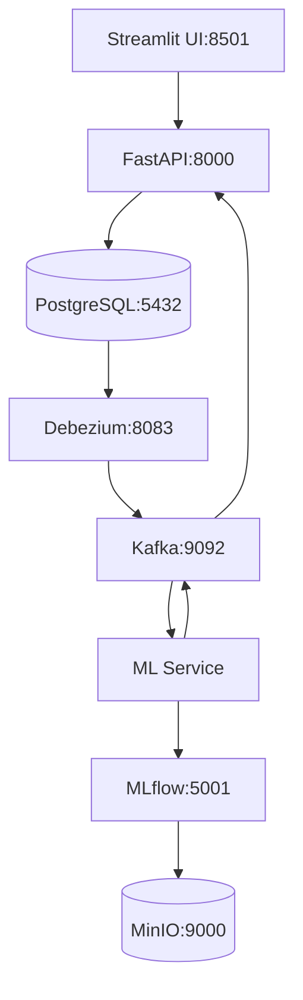

# Microservices Architecture

## Service Overview

## Service Descriptions

### 1. Frontend Service (Streamlit)

- **Port**: 8501
- **Purpose**: User interface and data visualization
- **Dependencies**: FastAPI Backend
- **Key Features**:
  - Interactive car price prediction
  - Data visualization dashboards
  - Real-time updates

### 2. Backend Service (FastAPI)

- **Port**: 8000
- **Purpose**: REST API and business logic
- **Dependencies**: PostgreSQL, Kafka
- **Key Features**:
  - CRUD operations
  - Data validation
  - API endpoints
  - Event publishing

### 3. Database Service (PostgreSQL)

- **Port**: 5432
- **Purpose**: Primary data storage
- **Dependencies**: None
- **Features**:
  - Logical replication
  - ACID compliance
  - JSON support

### 4. Message Broker (Kafka)

- **Port**: 9092
- **Purpose**: Event streaming and messaging
- **Dependencies**: Zookeeper
- **Features**:
  - Event streaming
  - Message persistence
  - Scalable messaging

### 5. ML Service

- **Purpose**: Machine learning predictions
- **Dependencies**: MLflow, Kafka
- **Features**:
  - Real-time predictions
  - Model serving
  - Feature processing

### 6. MLflow Service

- **Port**: 5001
- **Purpose**: ML model management
- **Dependencies**: MinIO, PostgreSQL
- **Features**:
  - Model versioning
  - Experiment tracking
  - Model registry

### 7. MinIO Service

- **Port**: 9000, 9001
- **Purpose**: Object storage
- **Dependencies**: None
- **Features**:
  - S3-compatible storage
  - Model artifacts storage
  - Scalable storage

### 8. Debezium Service

- **Port**: 8083
- **Purpose**: Change Data Capture
- **Dependencies**: Kafka, PostgreSQL
- **Features**:
  - Database change tracking
  - Event generation
  - Data streaming

## Inter-Service Communication

### Synchronous Communication

- REST APIs between Frontend and Backend
- gRPC for ML Service predictions

### Asynchronous Communication

- Kafka events for data changes
- Message-based updates
- Event-driven processing

## Deployment Configuration

### Container Orchestration

- Docker Compose for development
- Kubernetes-ready architecture
- Health checks for all services

### Scaling Considerations

- Horizontal scaling capability
- Load balancing ready
- Stateless services where possible

## Monitoring & Management

### Service Health

- Health check endpoints
- Container health monitoring
- Database connection pooling

### Management UIs

- Kafka UI for message monitoring
- Adminer for database management
- MLflow UI for ML operations
- MinIO Console for storage management
